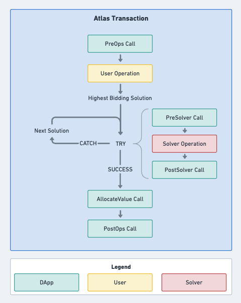
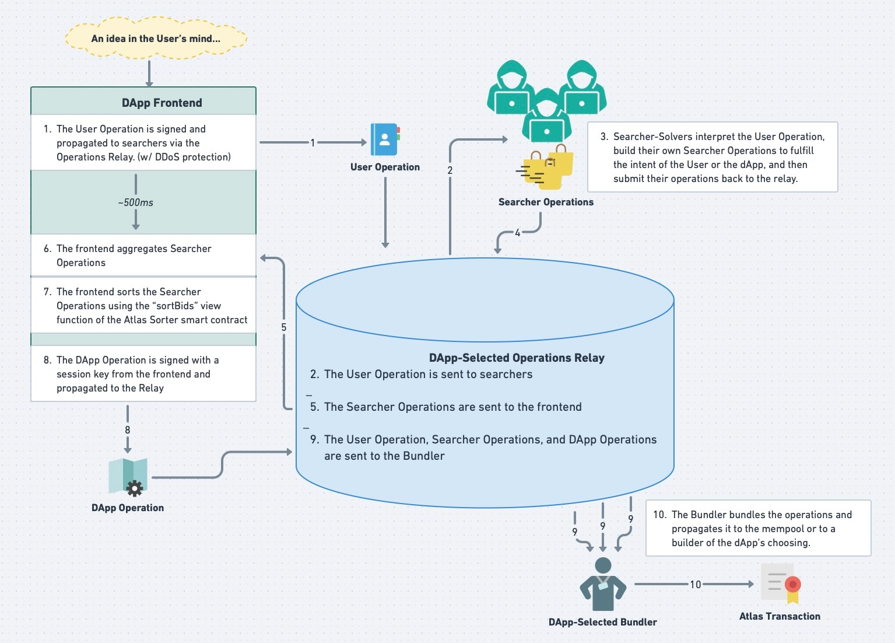

# Atlas

### Concept:

Atlas is a permissionless and modular smart contract framework for Execution Abstraction. It provides apps and frontends with an auction system in which Solvers compete to provide optimal solutions for user intents or MEV redistribution.  A User Operation is collected by the app's frontend via the Atlas SDK and sent to a app-designated bundler, which combines it with Solver Operations into a single transaction. 

### DApp Integration

A frontend or API wishing to participate can integrate with Atlas by completing three steps:

1. Embed the Atlas SDK into their frontend or API to generate userOps.
2. Choose an Operations Relay to facilitate communication between users and solvers.
3. Create and publish a DAppControl contract that contains the logic specific to your application.
4. Interact with the Atlas contract to initialize the DAppControl contract and link it to the Atlas SDK on their frontend or API.

### Network Overview

Atlas is infrastructure-agnostic; each app may choose how the User Operations and Solver Operations are aggregated by their choice of Operations Relay. Examples include:
1. **BloXroute**: When Atlas is launched, BloXroute's BDN will support the low latency aggregation of User and Solver Operations. 
2. **SUAVE**: Once live, Operations can be sent to the SUAVE network, aggregated into a transaction by the SUAVE Atlas implementation, and then made available for use by bundlers.
3. **On Chain**: When gas costs and throughput are not an issue, Solver Operations may be sent on-chain, and then aggregated by any party, including a smart contract. 
4. **On Another Chain**:  Solver Operations may be posted and aggregated on another chain, and the output can be used to settle the atlas transaction on the settlement chain.

### Auctioneer Overview

Each frontend may choose a party to act as the auctioneer.  **It is strongly recommended to select the auction beneficiary act as the auctioneer.**  This is the most teust-minimized solution because he beneficiary can always trust themselves.  We expect most -but not all- frontends to select the user as the auctioneer and to handle the auctioneer duties without user input through the Atlas SDK in the frontend/API, as the user also explicity trusts the frontent/API.

The auctioneer is tasked with signing a **DAppOperation** that includes a **CallChainHash**.  This hash guarantees that the bundler cannot tamper with the execution order of the **SolverOperation**s.  Any party can easily generate this hash by making a view call to the *getCallChainHash(SolverOperations[])* function. Note that infrastructure networks with programmable guarantees such as SUAVE will not require this as it can be handled trustlessly in-network. 

***Auctioneer Example***:
*Featuring BloXroute as the Operations Relay*
1. User connects to a frontend and receives a session key.
2. User signs their UserOperation, which is propagated over the bloXroute BDN to solvers.
3. The frontend receives SolverOperations back via the BDN.
4. The frontend calls the *getCallChainHash()* view function via the User's wallet's RPC.
5. The frontend then uses the session key from step 1 to sign the **DAppOperation**, which includes the **CallChainHash**.
6. The frontend then propagates the DAppOperation over the BDN to a designated bundler, if the user themselves is not the bundler.

Note that any bundler who tampers with the order of the SolverOperations will cause the transaction to revert, thereby blocking any gas reimbursement from Atlas.

Note that input from the User is only required for step 2; all other steps have no impact on UX. 

### Atlas Transaction Structure

#### DAppControl

The DAppControl contract is where frontends and APIs define functions that will execute at specific stages during the Atlas transaction.  The contract also contains app-specific settings, such as the address of permitted bundlers, or if  the asynchronous processing of User nonces is permitted.  These functions and settings are referenced by the Atlas smart contract during execution to create a trustless environment that is maximally composable with the DApp's existing smart contracts - no upgrades or redeployments are required.  

The DAppControl contract may define which entities are permitted to act as the Bundler.  The frontend can designate one or more of the following:
1. **DAppProxy**: A specific address (or addresses) is permitted to bundle operations.
2. **User**: The User is permitted to bundle operations.
3. **Builder**: The builder ("block.coinbase") is permitted to bundle operations.
4. **Solver**: The top-bidding Solver is permitted to bundle the User Operation and their own Solver Operation, but may not include the Operations of other Solvers. 
5. **Conditional**: A specific function handles complex Bundler designation logic.
6. **Time Limit**: For On Chain auctions, any party may trigger the On Chain Bundler to execute the finalized transaction, pursuant to the passing of a minimum auction duration (as specified by the DApp.) 

The DAppControl contract *must* define the following functions:
1. **BidFormat**: This function defines the base currency (or currencies) of the auction. 
2. **BidValue**: This function defines how to rank bids so that they may be sorted by the auctioneer.
3. **AllocateValue***: After a Solver's operation is executed successfully, this function is called to allocate any value that has accrued to the Execution Environment. 

The DAppControl contract has the option to define functions that execute at the following stages:	
1. **PreOps***: This function is executed before the User's operation
2. **PreSolver***: This function is executed after the User's operation but before a Solver's operation. It occurs inside of a try/catch; if it reverts, the current Solver's solution will fail and the next Solver's solution will begin. If the Solver's operation or the PostSolver function revert, anything accomplished by the PreSolver function will also be reverted. 
3. **PostSolver***: This function is executed after the User's operation and after a Solver's operation. It occurs inside of a try/catch; if it reverts, the PreSolver function function, and the current Solver's operation will also be reverted and the next Solver's solution will begin.
4. **PostOps***: This function is executed after the successful execution of a Solver's operation and the allocation of their solution's value. If this function reverts, the User's operation will also be reverted. 

*These functions are executed by the Execution Environment via "delegatecall."

#### Ex-Post Bids
When bid amounts are known ahead of time by solvers the _bidKnownIteration() function is called and bids are sorted by bid amount, and executed until one is successful. If bid amounts are not known beforehand, such as when they are doing blind on-chain solving, the _bidFindingIteration() function is called to calculate the bid amounts on-chain. This is done by calling the same _executeSolverOperation() used in the _bidKnownIteration() for each solverOp, and checking the balance of the contract before and after to calculate the bid amounts for each aolverOp.

#### Permit69
A user must have an Execution Environment (EE) instance for each DApp they would like to use, and the user address is used as a salt for the create2 deterministic deployment of it. If one is not already available, EEs can be deployed during execution of a user order since their address is known beforehand, this gas cost is covered by the solver so UX is never impacted. The EE performs ops via delegateCalls, so it needs to be able to initiate token transfers from the user. Users only have to approve the Atlas contract once because Permit69 allows Atlas to transfer funds from the user if the request is from a valid EE for that user (checked by verifying the user address is one of the salts for the EE address). Permit69 is also used by DApps, but instead transfers tokens that have accumulated in the DAppControl contract, this function performs the same verification of the EE. 

#### ExecutionBase
_availableFundsERC20() is used to check the approved balance of users and dapps to atlas that can be withdrawn via permit69.

_transferDAppERC20() and _transferUserERC20() are functions that can be implemented by Atlas module developers in DappControl to access the user or dapp funds referenced in _availableFundsERC20().

Module developers can access useful information about the atlas transaction by initializing an ctx struct in their DappControl and accessing these fields: bundler, solverSuccessful, paymentsSuccessful, callIndex, callCount, phase, solverOutcome, bidFind, isSimulation.

The _contribute() function allows actors to sponsor the gas of the transaction by donating ETH to the Atlas Escrow balance. This contribution to the balance is available first to bundlers, with the surplus going to solvers.

The _borrow() function makes flash loans available from the Atlas Escrow balance. The balance must be repaid by the end of the Atlas transaction by the solver or the borrower.

### Atlas Frontend / Infrastructure Flow

### Advantages:
- Atlas Solvers have first access to any value created by the User Operation.  This exclusive access supercedes that of any wallets, RPCs, relays, builders, validators, and sequencers.  

- By acting as the Auctioneer for the Solvers and the beneficiary of any surplus value, Governance bypasses the "trusted auctioneer" problem by virtue of being able to trust itself. 

- The allocation of MEV is modular and fully customizable by DApp Governance.  For example, they could elect to use a portion of the MEV to refund the User's gas cost, a portion to offset the impermanent loss of the protocol's liquidity providers, and the remainder to buy that protocol's governance token for the User. 

- Due to the unique nature of the Execution Environment - a smart account that Atlas creates to facilitate a trustless environment for Users, Solvers, and DApps  - Users have an extra layer of protection against allowance-based exploits.

- By default, a successful Solver must pay the full gas cost of the transaction less the gas attributed to the failed operations of other Solvers.  DApp Governance has the option to subsidize a Solver's gas cost *conditionally* based on the *result* of the User's (or Solver's) execution. 

- By putting control of any User-created value in the hands of each frontend's Governance team, and by retaining the MEV or intent-generated value before RPCs or private relays see the transaction, Atlas has the potential to nullify the value of private orderflow, thereby acting as a counterforce to one of the strongest centralization vectors in the Ethereum ecosystem. 

### Disadvantages:

- Just as in the early days of Ethereum, Solvers do not benefit from "free reverts." If a Solver Operation fails, then the Solver still must pay their gas cost to the Bundler.  Gas cost acts as a DDoS mitigator - this is a good thing for permissionless auctions. 

- Atlas represents a less efficient use of block space than traditional, infrastructure-based MEV capture systems. This arises due to the checks and verifications that allow Atlas to function without relying on privacy guarantees from centralized, third-party infrastructure or off-chain agreements with permissioned builders.  Note that this extra usage of gas will typically be handled by Solvers, and that if no Solver is willing to pay for the increased gas cost then the User can simply do a non-Atlas transaction. In other words, the extra gas cost will only be incurred when its cost is less than its expected benefit. 

### Notes:

Note that the auctioneer (typically the frontend) and/or the Operations relay may want to use a reputation system for solver bids to efficiently use the space in the solverOps[]. This isnt necessarily required - it's not an economic issue - it's just that it's important to be a good member of the ecosystem and not waste too much precious blockspace by filling it with probabalistic solver txs that have a low success rate but a high profit-to-cost ratio.
