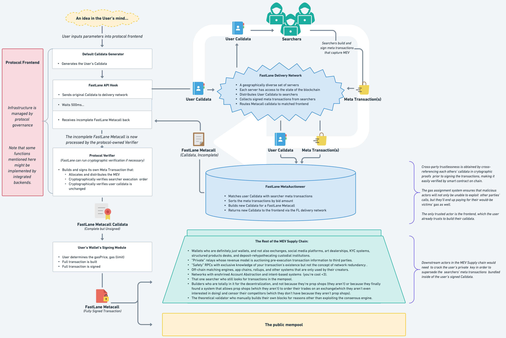

# Atlas
*This repo is still under development.  No assumptions about the production implementation of Atlas should be derived from reading the current codebase; many core design elements and interfaces can -and probably will- be changed.*

### Concept:

Atlas is a system that combines a highly advanced smart contract with a frontend API to allow DeFi protocols to control how and where to allocate the MEV generated by their users' transactions. One of the key roles of a DeFi frontend is to build a transaction's "calldata" that defines what the User's transaction will do. Atlas works by injecting the calldata for Solvers' meta transactions at the end of the User's calldata; this occurs *before* the User signs the transaction. By including the User's calldata and the Solvers' calldata inside of a singular transaction that's governed by the logic of the Atlas smart contract, DApp Governance is guaranteed that downstream actors such as wallets, RPCs, relays, builders, and validators will not be able to redirect the MEV to suit their own purposes. 

### Network Overview

### Atlas Metacall Structure

### Advantages:

- No dependencies on centralized infrastructure or need for any trusted wallet, RPC, relay, builder, or validator.

- DApp Governance retains full control of allocating the MEV captured by the Atlas solvers. This is true even when the User sends the signed transaction through an OFA-based RPC.

- The allocation of MEV is modular and fully customizable by DApp Governance.  For example, they could elect to use a portion of the MEV to refund the User's gas cost, a portion to offset the impermanent loss of the protocol's liquidity providers, and the remainder to buy that protocol's governance token for the User. 

- The Atlas smart contract allows the entire system to be trustless for all parties involved - Solvers, Users, and DApp Governance.  

- DApp Governance can make use of additional guard rails and safety checks in the Atlas contract for the benefit of the User.  Checks can be added to verify that no Solvers have exploited their transaction, empowering them to undo the User's transaction *after* seeing the *result* of the Solvers' transactions. 

- To mitigate the risk of "sandwich attacks", DApp Governance can configure Atlas to detect DEX pricing anomalies and subsequently block the execution of the User's portion of the transaction while allowing the execution of the Solvers' portion of the transaction.  This will redirect the value of the attacker's frontrunning transaction and allow DApp Governance to allocate the proceeds back to the User.  Note that this is a more robust version of the game theory currently being used by FastLane to protect Polygon's users. 

- Due to the unique nature of the Execution Environment - a single-use, disposable smart wallet that Atlas creates solely for executing the transaction - Users have an extra layer of protection against allowance-based exploits.

- While it is mandatory for Solvers to refund Users for the cost of the Solvers' portion of the transaction, DApp Governance also has the option to subsidize a User's gas cost. Note that unlike traditional Account Abstraction protocols, Atlas empowers DApp Governance to subsidize the User's gas costs *conditionally* based on the *result* of the User's (or Solver's) execution. 

- By putting control of MEV in the hands of each DApp's Governance team, and by capturing the MEV before any RPCs or private relays see the transaction, Atlas has the potential to nullify the value of private orderflow, thereby acting as a strong counterforce to one of the strongest centralization risks in the Ethereum ecosystem. 

### Disadvantages:

- Just as in the early days of Ethereum, Solvers do not benefit from "free reverts." If a Solver's MEV transaction fails, then the Solver still must pay their gas cost to the User.

- Due to the safety checks, the overall gas cost is expected to be higher than it would be for the sum of the individual transactions. Note that DApp Governance will have the capacity to simulate the net gas cost increase and to only initiate an Atlas transaction when deemed prudent.

- Atlas represents a less efficient use of block space than traditional, infrastructure-based MEV capture systems. This arises due to the checks and verifications that allow Atlas to function without relying on privacy guarantees from centralized, third-party infrastructure or off-chain agreements with permissioned builders.  

### Notes:

Note that there is significant complexity in the lock system.  This was designed to handle ALL cases, rather than having to deploy multiple contracts to handle SOME cases, so as to avoid the fragmentation (capital inefficiency and upkeep effort) of the solver's escrowed gas values.  Other factory contracts may be launched with less complexity - such as one that has no delegatecall and therefore no need to create a new contract each time - but the Escrow contract must be designed to handle the *most* complex of those designs or solvers' gas values will be fragmented.

Note that the backend will probably need to use a reputation system for solver bids that aren't in the top three in order to not take up too much space in the block.  The further down the the solverOps[], the higher the reputation requirement for inclusion by the backend. This isnt necessarily required - it's not an economic issue - it's just that it's important to be a good member of the ecosystem and not waste too much precious blockspace by filling it with probabalistic solver txs that have low success rate but high return-to-cost rate. 