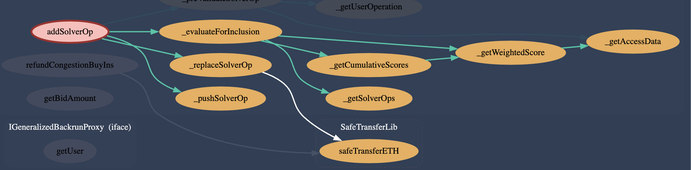
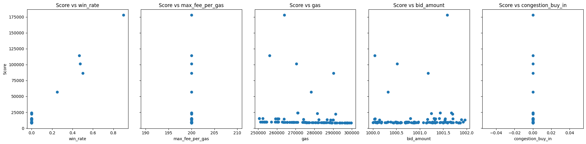
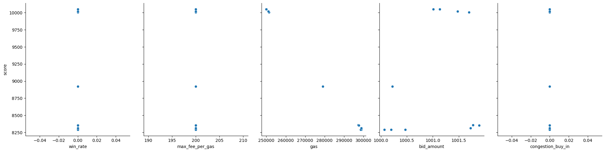
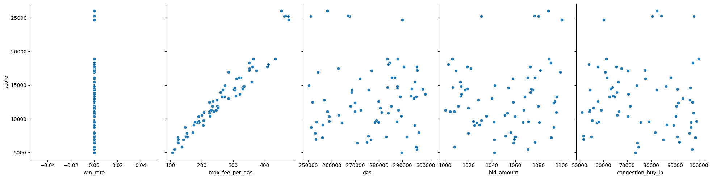
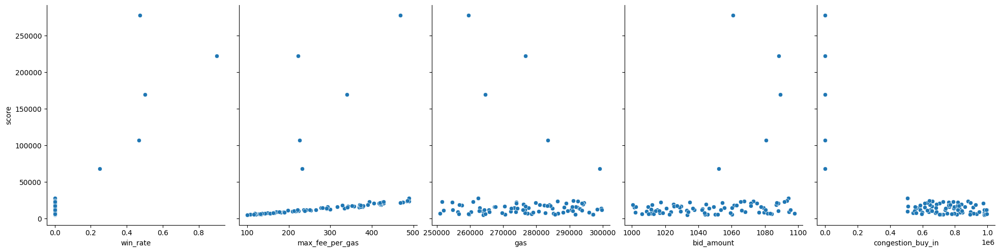

## Reputation formula




The weighted score for a solver's operation is calculated using the following formula:


$$
\text{score} = \left( \frac{(\text{congestionBuyIn} + (\text{maxFeePerGas} \times \text{totalGas})) \times \text{totalGas}}{\text{totalGas} + \text{solverOp.gas}} \right) 
\times \left( \frac{\text{aData.auctionWins} + 1}{\text{aData.auctionWins} + \text{aData.auctionFails} + \text{solverCount}^2 + 1} \right)
\times \left( \frac{\min\left( \left( \frac{\text{solverOp.bidAmount}^2 \times \text{\_SLIPPAGE\_BASE}}{(\text{minAmountUserBuys} + 1)^2} \right), \text{\_GLOBAL\_MAX\_SLIPPAGE} \right)}{1} \right)
\times \frac{1}{\text{solverOp.gas}}
$$


#### _________
1. A higher congestion buy-in increases the solver's score since it signifies a greater willingness to pay for execution priority and disincentive against multiple EOAs - that will eventually lose their cumulative amount
2. With A higher Solverops.gas the score decreases with higher gas requirements
3. Higher searcher winning rates increase the score as it reflects the solver's reliability and past success. As reputation grows a lower congestion buy-in is required to score above the threshold.
4. Higher solver count reduces the impact of a single solver's auction history, adding a balancing factor.
5. Higher bid amounts generally increase the score, but the effect is adjusted by the _SLIPPAGE_BASE to prevent excessive influence.
6. The solver's auction success rate, adjusted by the number of solvers, influences the score, rewarding more reliable solvers.


#### _________


In the file the score is used in the `function _evaluateForInclusion` which returns `(bool pushAsNew, bool replaceExisting, uint256)`. It is used as follows:
```solidity
        if (_score * totalGas > _cumulativeScore * solverOp.gas * 2) {
            if (_cumulativeGasReserved + USER_GAS_BUFFER + (solverOp.gas * 2) < totalGas) {
                return (true, false, 0);
            } else {
                return (false, true, _replacedIndex);
            }
        }
        return (false, false, 0);
```

Where _cumulativeScore aggregates the scores of all solver operations to get a total (cumulativeScore) and identifies which operation has the lowest score.

#### Parameters

- `S_congestionBuyIn`: SolverOP additional bid amount willing to pay to be included as msg.value - native transfer.
- `S_aggCongestionBuyIn`: TotalBidValue of a certain userOP hash.
- `maxFeePerGas`: The maximum fee per gas unit.
- `totalGas`: Total gas available for the metacall to be executed.
- `solverOp.gas`: The gas used by the solver operation.
- `aData.auctionWins`: Number of auction wins from account data of the searcher.
- `aData.auctionFails`: Number of auction fails from account data of the searcher.
- `solverCount`: The number of solvers in this auction.
- `solverOp.bidAmount`: The bid amount of the solver operation always > minAmountUserBuys.
- `minAmountUserBuys`: The minimum amount the user is willing to be solved for.


## Simulation 1

- **5 Searchers:**
  - **Searcher_1:** 90 wins, 10 fails
  - **Searcher_2:** 90 wins, 100 fails
  - **Searcher_3:** 25 wins, 25 fails
  - **Searcher_4:** 35 wins, 40 fails
  - **Searcher_5:** 300 wins, 900 fails

- **100 Spammers:** 
  - Each spammer has 0 wins and 0 fails.

### Bidding Details

- **Bid Amount:**
  - Good searchers: 1001
  - Spammers: 2000

- **Congestion Buy-in:** 0 for everyone
- **Max Fee Per Gas:** 200 for everyone

### Result

| Metric                      |        Value |
|-----------------------------|--------------|
| average_score_pushed        | 100505       |
| average_score_rejected      |  11392.9     |
| average_win_rate_pushed     |      0.51807 |
| average_win_rate_rejected   |      0       |
| average_bid_amount_pushed   |   1000.71    |
| average_bid_amount_rejected |   1999.55    |
| spammers_pushed             |      0       |

Score goes us proportionally to reputation (win rate).




## Simulation 2

- **106 Eqal EOAs:** 
  - Each seacher has 0 wins and 0 fails | random SolverOp.gas and 0 Congestion BuyIn

| Metric                      |     Value |
|-----------------------------|-----------|
| average_score_pushed        |   9809.99 |
| average_score_rejected      |   8316.34 |
| average_win_rate_pushed     |      0    |
| average_win_rate_rejected   |      0    |
| average_gas_pushed          | 256295    |
| total_gas_rejected          | 298326    |
| average_bid_amount_pushed   |   1001.11 |
| average_bid_amount_rejected |   1001.02 |
| average_congestion_pushed   |      0    |
| average_congestion_rejected |      0    |
| average_max_fee_pushed      |    200    |
| average_max_fee_rejected    |    200    |


Score is similar for pushed and rejected in this case - higher score is therfore given to lower SolverOp.gas




## Simulation 3

- **106 random EOAs:** 
  - Each seacher has 0 wins and 0 fails | random SolverOp.gas | random Congestion BuyIn | random max_fee_per_gas 200 - 500

| Metric                      |      Value |
|-----------------------------|------------|
| average_score_pushed        |  25293.5   |
| average_score_rejected      |  12002.2   |
| average_win_rate_pushed     |      0     |
| average_win_rate_rejected   |      0     |
| average_gas_pushed          | 266678     |
| total_gas_rejected          | 277888     |
| average_bid_amount_pushed   |   1075.2   |
| average_bid_amount_rejected |   1048.68  |
| average_congestion_pushed   |  81007.1   |
| average_congestion_rejected |  74922.3   |
| average_max_fee_pushed      |    467.049 |
| average_max_fee_rejected    |    245.327 |




## Simulation 4

- **5 Searchers:**
  - **Searcher_1:** 90 wins, 10 fails
  - **Searcher_2:** 90 wins, 100 fails
  - **Searcher_3:** 25 wins, 25 fails
  - **Searcher_4:** 35 wins, 40 fails
  - **Searcher_5:** 300 wins, 900 fails

- **100 Spammers:** 
  - Each spammer has 0 wins and 0 fails.

- **Congestion Buy-in:** 0 for reputation-searcher and random for spammers

from the result only one EOA with 0 managed to push a solverOp (it replaced Seacher_5) but it had to bid a 659576.014 CongestionBuyIn

| Metric                      |         Value |
|-----------------------------|---------------|
| average_score_pushed        | 160247        |
| average_score_rejected      |  14086        |
| average_win_rate_pushed     |      0.46807  |
| average_win_rate_rejected   |      0.003125 |
| average_gas_pushed          | 275373        |
| total_gas_rejected          | 277036        |
| average_bid_amount_pushed   |   1078.53     |
| average_bid_amount_rejected |   1046.83     |
| average_congestion_pushed   | 131915        |
| average_congestion_rejected | 748248        |
| average_max_fee_pushed      |    349.361    |
| average_max_fee_rejected    |    270.808    |
| spammers_pushed             |      1        |



